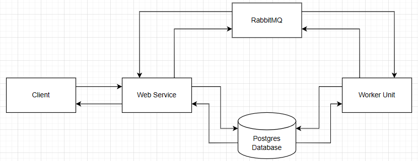
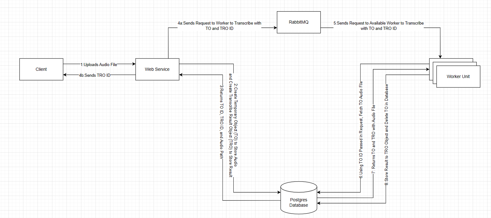
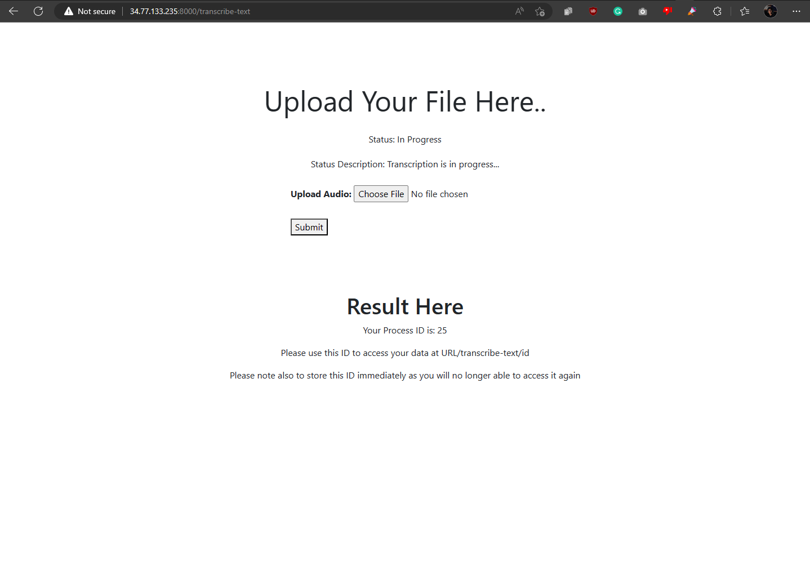
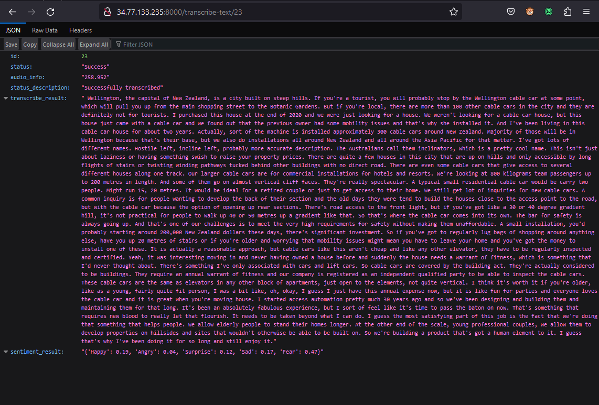
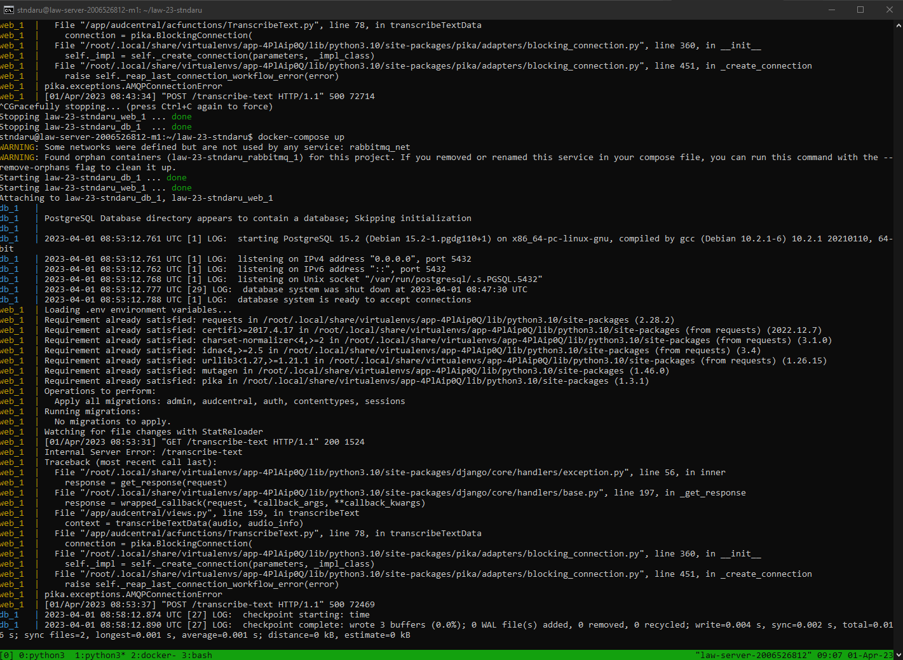

# Audio Central v2
#### Layanan Aplikasi & Web Project by Stefanus Ndaru W - 2006526812
    

# Assignment 02 Section
## App Explanation
### Overview
Audio Central, the web service that's oriented around audio, but mainly music, has just gotten a new update! Now Audio Central supports audio transcription, which enables you to upload an audio and transcribe it to text format alongside with sentiment analysis. The audio transcription process utilizes Open AI Whisper Text Transcription Model, enabling you to transcribe text as accurate as possible using today's technology and limitation. 

> In summary, with this new addition, you can:    
Upload an audio file and receive Text Transcription and Text Sentiment Analysis based on 5 moods: Happy, Angry, Surprise, Sad and Fear    
     
### Background
This idea came from an inspiration where processing audio can be tedious, especially if you want to analyze it. Now, Open AI has released it's Whisper model, and I am able to import and run the model in GCP. With this, you can convert audio to text, and with text format, you can run a lot of things such as document to word to make it searchable, analyze it, translate it, and more. But, because of time limitation, I can only implement transcription and sentiment analysis only for now.

### How it Works
**Transcription Process**    
The transcription process works by using Open AI Whisper Model (see: https://github.com/openai/whisper). The model is imported into the GCP VM Instance and run to transcribe it using Python. The model receives an audio file and returns the detected language with the resulting transcription. The text then is also analyzed by Text2Emotion and detect the sentiment/mood of the text. This is then combined with the transcription to provide the text transcription and sentiment analysis result.

**Web Service Process**   
In concept, the Text Transcription Web Service runs asynchronously using Rabbit MQ to queue messages to available workers in order to process and do the transcription service. The system architecture looks similar to below:    


    
The client - the user using web browser or service - will connect with the web service (Django), while the web service will queue process through Rabbit MQ. Rabbit MQ then will queue the request and send it to available workers. The workers then process it and store it to the database where the result could be fetched in later time.    

To further provide detail, below is the process for requesting a text transcription process:   


    
The process request is as follows:
1. Client requests to web service by providing an audio file
2. Web service creates an object to store the audio file temporarily and another object to store the result which could be accessed later on
3. Database returned the objects to the web service
4. Web service informs the user that the transcription is in progress, providing the ID which the user can use to retrieve the result once its done. At the same time, the web service queues the request to RabbitMQ, where RabbitMQ then queued the request
5. Once there is an available worker, RabbitMQ then sends the request to the available worker to process
6. The worker then access the database using the temporary object ID and retrieve the audio file, and also the reference for the object to store result to be used later on
7. The database then provides the audio file and the result object to store the result in
8. The worker then uses Open AI Whisper Model and Text2Emotion to transcribe the text and determine the text's sentiment. Once finished, the worker then store the result to the result object, and store it to the database. The worker also informs database that process is complete and the audio file is no longer needed, thus the database will delete the temporary audio file to save storage.

Other Notes:   
1. The workers are made using Django's Management/Command system, enabling it to run in paralel with the web service while still able to access the database
2. The functions and workers alongside the message queuing with RabbitMQ are made to be modular so its easy to extend in the future
3. After step 4, where client has received the ID, the client/user can always access it using the ID to check the progress or receive the result once finished
4. Process 4 and 5 in RabbitMQ currently uses the default direct queue with round-robin principle, but can easily be modified and improved to use acknowledgement
5. The result can only be viewed in JSON format, while uploading can be through `curl` or `webview`

---
## List of Features

### [Flagship Feature] Text Transcription with Sentiment Analysis
Transcribes an audio to text from an uploaded audio file and analyze the text's mood based on 5 category: Happy, Angry, Surprise, Sad and Fear   
> Note that the transcription result are publicly available and can be accessed by anyone, therefore it is encouraged that you do NOT use this service to transcribe classified or publicly unavailable audio file    


**Parameter List**
```
mp3 file of a valid audio file
```
**Curl Call Example**
```
curl http://34.77.133.235:8000/transcribe-text/json -i -F csrfmiddlewaretoken=<csrf-token> -F audio=@<path/to/file>;type=audio/mpeg
```
**Result Example**

You can obtain the result by accessing `http://<link>/transcribe-text/<id>` where `<link>` is the URL where you can host the service. The result will always be in JSON format for now.   

> id = your unique id to access the transcription result  
> status = the status for the transcription process    
> audio_info = the length of the audio file in seconds   
> status_description = the detailed status for the transcription process   
> transcribe_result = the transcription result     
> sentiment_result = the sentiment analysis of the transcribed text

You might receive errors when uploading, which can be viewed on the corresponding error message through `status_description`.    

```json
{
    "id": 17, 
    "status": "Success", 
    "audio_info": "8.619", 
    "status_description": "Successfully transcribed", 
    "transcribe_result": " I'm out of pain, but I'm trying to go home All of my chains are spanned", 
    "sentiment_result": "{'Happy': 0.0, 'Angry': 0.0, 'Surprise': 0.0, 'Sad': 1.0, 'Fear': 0.0}"
}
```
**Web View URL**
```
<link>/transcribe-text
```
**Screenshot Example**    
Web View    

JSON View 
 

---
## Application/Web Service Development Difficulties & Complexity
Eventhough the web service seems simple, there are a lot of difficulties that I had to face:    
1. **Running Whisper Model from Open AI on GCP**    
As mentioned above, Whisper is a text-transcription model made by Open AI. As an AI model that could transcribe audio, it was originally designed to use CUDA-based graphic card, which was not present on GCP. On top of it, it also required a lot of old libraries such as `ffmpeg`. Trying to run Whisper and installing the library was tedious and I ran across multiple error. In the end, I managed to run everything well after following a lot of tutorial, and along the way found a method to run the model on CPU without a too big of a performance issue using https://github.com/MiscellaneousStuff/openai-whisper-cpu
2. **Running RabbitMQ in GCP alongside Django**    
RabbitMQ in itself is quite simple, but it gets really tricky when pairing it with frameworks such as Django. I had issue on running RabbitMQ on Django while maintaining access to the database file, where I kept getting AMQP Error on top of `unable to find module "pika"`. I had a lot of debugging and configuration on the GCP but managed to solve it after refactoring the file system to be modular.
3. **Running Sentiment Analysis**   
Compared to other, this issue is quite minor but frustrating, where the library I used to do text analysis, Text2Emotion, was outdated and running an old Emoji library, so I had to downgrade it for it to work
4. **Creating Asynchronous Service**   
By far this is one of the most challenging part, where I had to run an external worker that could still connect to RabbitMQ and the Django Database (because we know that python script outside of the Django file will not be able to access it). I had to do a lot of digging, and finally found the solution using Django Admin Command (https://docs.djangoproject.com/en/4.1/howto/custom-management-commands/). This was really new to me and it was really interesting and became a valuable learning point where I could run a python script inside the Django framework separated from the web service. Using this, I could run a separate worker connected to RabbitMQ while still able to access the database to store the result and achieve asynchronous service with the help of `tmux` to run the webservice and workers in parallel.
5. **Creating Temporary File Solution**   
One issue I faced was that the temporary file using `request.FILES` was too short-lived and was deleted before the worker could process the file. So I had to find ideas, and decided to use a temporary object/models where the audio would be stored, and then deleted once it was done processed.
6. **Creating the System to be Modular in Nature**   
This was minor but frustrating, because I had to do a major refactor in separating functions and processes so code is much more readable and modular. I learned how to use Python's importing system much more thoroughly and implemented what I had learned on Advanced Programming Course.
7. **[Failed] Running Service Using Docker**  
This was by far the hardest one, harder than point 4 but I decided not to mention as the hardest because technically I failed. Originally, the service used docker, but I can't get it to work with RabbitMQ despite the amount of things I tried, from running RabbitMQ in the same container, creating new docker network, and running RabbitMQ in a separated container. But I kept getting 2 issues: whisper couldn't be loaded into the docker container, and RabbitMQ just wouldn't connect and kept throwing `AMQP Connection Error`.     
With the deadline fast approaching, I decided to ditch this for now and let this be something for the future me to fix.

## Application/Web Service Usability/Urgency
This website can have multiple functionalities based on the available features, which are:   
1. Text Transcription
You can receive the text transcription from an uploaded audio file with high accuracy using Open AI's Whisper Model. This can be very useful for obtaining the text from a meeting, saving time for people without having to manually take note what the person is saying. One important use case is lecture notes, where you just need to record the audio, and you can get the full audio transcript as a note from the lecturer with ease.
2. Sentiment Analysis    
With the transcribed text, you will be able to receive the sentiment analysis which could determine the mood of the submitted audio. This can be useful for when you've recorded a conversation, speech, or any kind of person talking and wanted to know the overall mood of the topic the person is conveying based on the selected words they chose to speak.
3. [Future Implementation] Text Translations, Text-to-Audio, Text-to-TranslatedAudio Modular Function, and More   
Due to time constraint, the other uses are currently not developed but can easily be integrated such as text translation or text to audio, the possibilities are endless as long as it works with text files with this modular service where you just need to modify the worker and specify the request type:   
    ```
    rmq_data = {
            "task" : "transcribe",
            "audio_info" : audio_info.length,
            "obj_id" : transcribed_audio_obj.id,
            "storage_id" : storage_obj.id
        }
    ```

## Application/Web Service Uniqueness
Currently, there are no audio transcription service that is available instantly, on-the-go, efficient, and with ease such as Audio Central, enabling people such as student or workers to capture the moment, easily transcripting audio to text without hassle. There are other alternatives such as MonkeyLearn, but they are paid services and are hard to use, requiring you to use API and other nonsense, and they are not as modular as this web service. Audio Central will provide the service you need with ease, and with flexibility.    


---

# How to run
Credit to Adrian Ardizza (Meta501)
### Locally
#### Requirements
- Python 3.10
- pipenv (install using python -m pip install pipenv)
#### Installation
- Run `pipenv install` on the project directory
- Create a new `.env` file based on `.env.example`
- Run `pipenv shell`
- Run `python manage.py runserver`
### Docker (For deployment on GCP)
#### Requirements
- Latest version of Docker
#### Installation
- Run `docker-compose up` on the project directory
- Application will deploy all necessary dependencies automatically
- If an error occurs during migration, rerun `docker-compose up`
