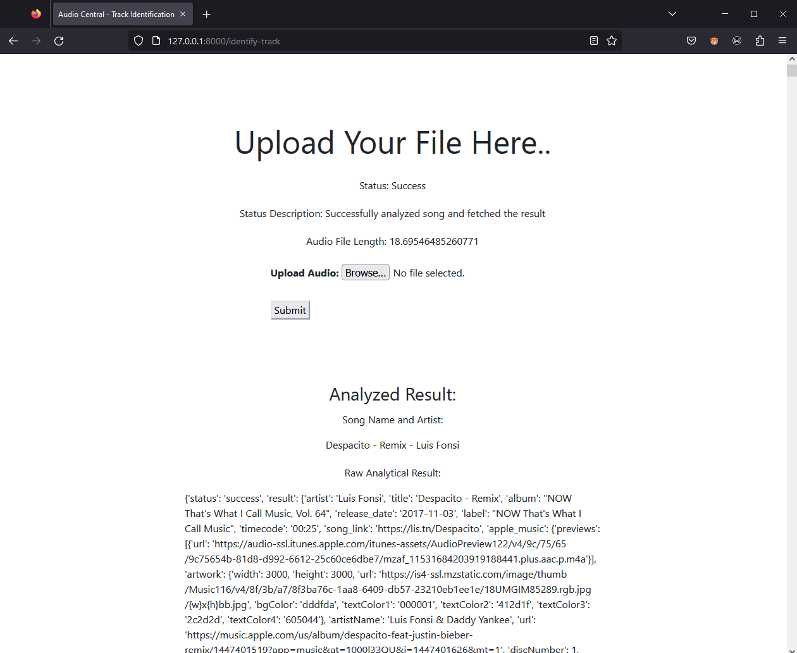
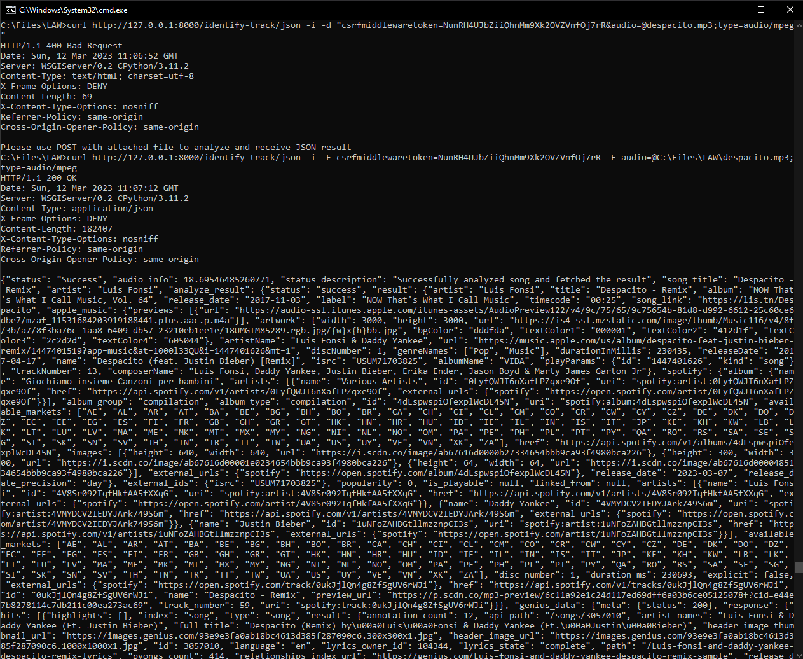
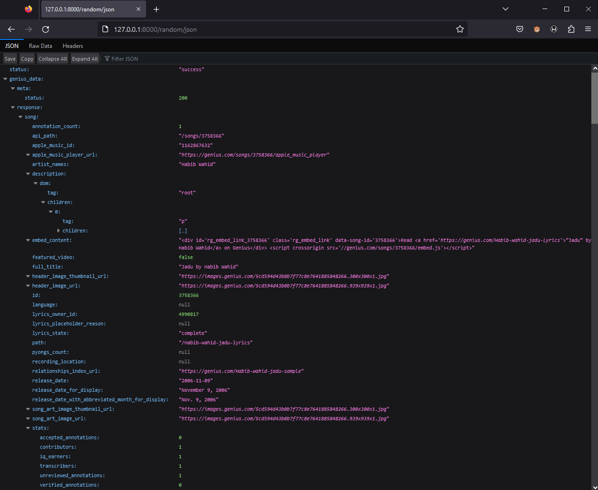
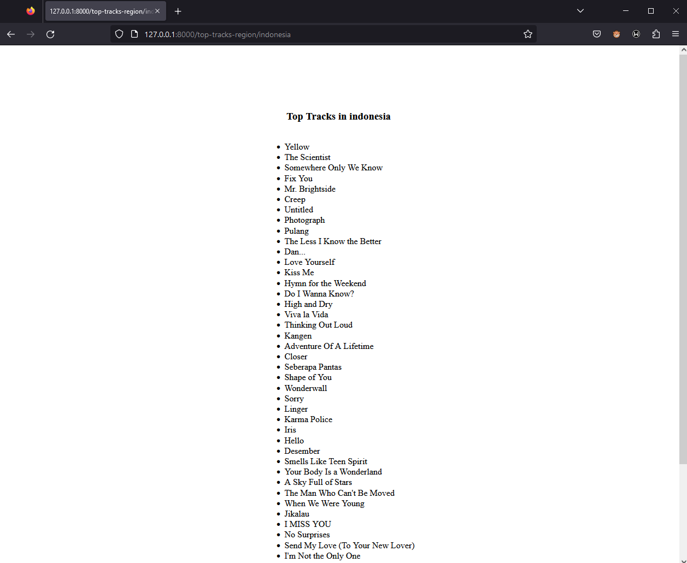
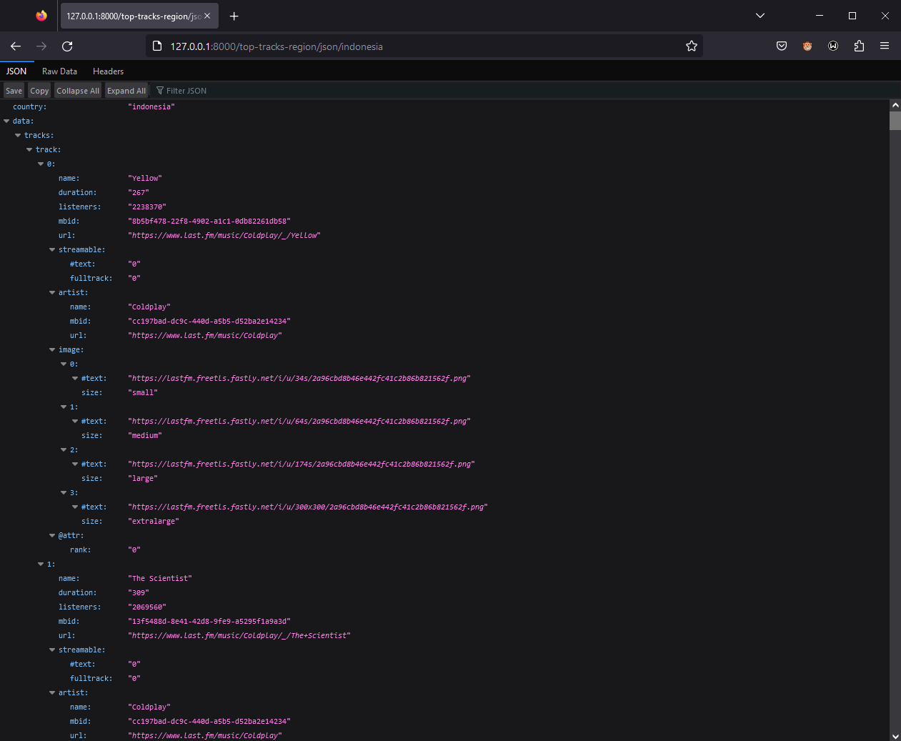
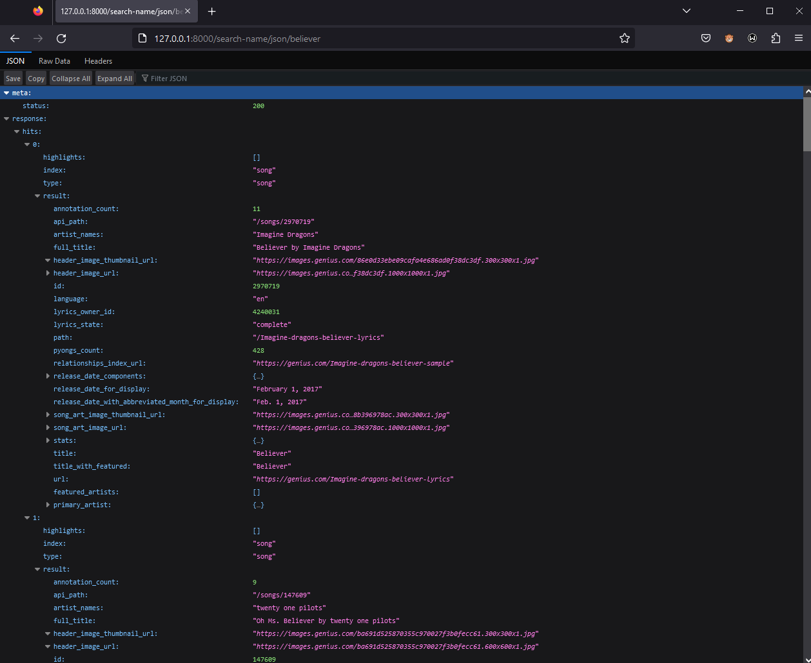

# Audio Central v1
#### Layanan Aplikasi & Web Project by Stefanus Ndaru W - 2006526812

## App Explanation
### Overview
Audio central is a web service oriented around audio, but mainly music. Here you can do multiple actions regarding music searching that are based mainly on two popular music information platform: Last.FM and Genius. Currently, you can 
1. Recognize a song based on uploaded audio file
2. Select a random song
3. Search top tracks based on region 
4. Search a song by title

### Background
This project was originated by my passion for music listening, and not through the idea from the assignment's details because I just realized it was mentioned there in the last day. Originally, I wanted to do a fully centralized audio including Text-Transcription using OpenAI Whisper, but sadly it was too costly to run GPU, a necessary component, in GCP (it costs up to $3000/month). So I set back that idea and decide to make a song recognizer that could integrate result with Genius and Last.FM, 2 big platform for looking up song details

---
## List of Functions


### [Flagship Feature] Song Recognizer
Recognize a song based on an audio uploaded with constraints of maximum 2MB size and 20 second duration, and fetched the song's details from Genius and Last.FM, if they exist   

**Parameter List**
```
mp3 file of target song with max duration of 20 second and max size of 2MB
```
**Curl Call Example**
```
curl http://127.0.0.1:8000/identify-track/json -i -F csrfmiddlewaretoken=<csrf-token> -F audio=@<path/to/file>;type=audio/mpeg
```
**Result Example**

>genius_data = data result from Genius platform   
>genius_data_detailed = data result from Genius track specific detail     
>lastFM_data = data result from Last.FM search    
>lastFM_data_detailed = data result from Last.FM track specific detail   

You might receive errors when uploading, which can be viewed on the corresponding error message through `status_description`.    

For further details, you can view the API guide for Genius (https://docs.genius.com/) and Last.FM (https://www.last.fm/api)


```json
{
    "status" : "<request_status>",
    "audio_info" : "<track_length>",
    "status_description" : "<status_description>",
    "song_title" : "<song_title>",
    "artist" : "<artist_name>",
    "analyze_result" : {"..."},
    "genius_data" : {"..."},
    "genius_data_detailed" : {"..."},
    "lastFM_data" : {"..."},
    "lastFM_data_detailed" : {"..."},
}

```
**Web View URL**
```
<link>/identify-track
```
**Screenshot Example**    
Web View    

JSON View 
   

### [Flagship Feature] Song Randomizer
Select a random song that exist in Genius's library and returns the detailing data of the song from Genius and Last.FM (if exist)    

**Parameter List**
```
none
```
**Curl Call Example**
```
curl http://127.0.0.1:8000/random/json
```
**JSON Result**

>genius_data = data result from Genius platform    
>lastFM_data = data result from Last.FM search    
>lastFM_data_detailed = data result from Last.FM track specific detail

```json
{
    "genius_data" : {
        "meta": {"..."},
        "response": {"..."}
    },
    "lastFM_data" : {
        "name" : "<song_name>",
        "artist" : "<artist_name>",
        "url" : "<song_lastfm_url>",
        "streamable" : "<song_streamable>",
        "listeners" : "<song_listeners>",
        "image" : {"..."},
        "mbid" : "<song_mbid>",
    },
    "lastFM_data_detailed" : {
        "track" : {
            "name" : "<song_name>",
            "url" : "<song_lastfm_url>",
            "duration" : "<song_duration>",
            "streamable" : {"..."},
            "listeners" : "<song_listeners>",
            "playcount" : "<song_playcount>",
            "artist" : {"..."},
            "toptags" : {"..."},       
        }
    }
}

```
**Web View URL**
```
<link>/random/json
```
Occasionally, this feature call will result in a `error` result which was caused by the random nature of the randomizer and the inconsistency of Genius library. Solving this can be done by retrying the call again.

**Screenshot Example**    
JSON View 
 


### Top Tracks by Region
Find top tracks that are currently being played based on country with data obtained from Last.FM   

**Parameter List**
```
ISO 3166 country code
```
**Curl Call Example**
```
http://127.0.0.1:8000/top-tracks-region/<region>
```
**Result Example**
```json
{
    "country": "country",
    "track": {
        "0" : {
            "name" : "<song_name>",
            "duration": "<song_duration>",
            "listeners" : "<song_listeners>",
            "mbid" : "<song_mbid>",
            "url" : "<song_lastfm_url>",
            "streamable" : {"..."},
            "artist" : {"..."},
            "image" : {"..."},
            "@attr" : "<song_attribute>",
        },
        "1" : {
            "..."
        }, "..."
    }
}
```
**Web View URL**
```
<link>/top-tracks-region/<country>
```
**Screenshot Example**    
Web View 
 
JSON View     
 

### Search Song based on Name
Search a song based on name and fetch result from Genius library, and fetch several songs with similar title to the inputted name    

**Parameter List**
```
valid song name
```
**Curl Call Example**
```
http://127.0.0.1:8000/search-name/json/<song-name>
```
**Result Example**
```json
{
    "meta": {
        "status" : "<service-call-status-response>",
    },
    "response" : {
        "hits" : {
            "0": {"..."},
            "1": {"..."},
            "..."
        }
    }
}
```
**Web View URL**
```
<link>/search-name/json/<song-name>
```
**Screenshot Example**    
JSON View 
 

## Application/Web Service Development Difficulties & Complexity
Eventhough the web service seems simple, there are a lot of difficulties that I had to face:    
1. File Upload via Form and Curl    
Originally I had no experience of using Django file upload system. I had to look up a blog on how to use it and how to access the file. From the web browser view, its simple just to use forms, but using `curl`, it was very difficult and I had to look up multiple Stack Overflow page and Curl Manpage just to get it working.
2. API Management (Fetching & Error Handling)    
The service I made is a combination of multiple other services, and having to manage accessing each of them is proven to be difficult. There are multiple edge cases and possibility for the API to broke, so I had to mitigate a lot of them through `try-except` clause by Python
3. API Merging & Requests   
As mentioned before, this service combines multiple other services, and having to pass different parameters between each one is very hard as one service could return something that's different from the other. Take for example the code below. Here, I had to parse the data obtained from Genius to Last.FM, and this require me to read the documentation, figure out the return key, and pass it onwards to the Last FM request   

```python
while genius_data['meta']['status'] == 404:
    song_id = random.randint(1,10000000)
    genius_request = "https://api.genius.com/songs/" + str(song_id)
    genius = requests.get(genius_request, headers={'Authorization': 'Bearer ' + GENIUS_TOKEN})
    genius_data = json.loads(genius.text)
    time.sleep(2)

song_title = genius_data["response"]["song"]["title"]

lastFM = requests.get(f"http://ws.audioscrobbler.com/2.0/?method=track.search&track={song_title}&api_key={LASTFM_TOKEN}&format=json")
lastFM_data = json.loads(lastFM.text)

if len(lastFM_data['results']['trackmatches']['track']) > 0:
    chosen_song_lastFM = lastFM_data['results']['trackmatches']['track'][0]

    LFM_song_title = chosen_song_lastFM['name']
    LFM_song_artist = chosen_song_lastFM['artist']

    lastFM_detailed_song = requests.get(f"http://ws.audioscrobbler.com/2.0/?method=track.getInfo&api_key={LASTFM_TOKEN}&artist={LFM_song_artist}&track={LFM_song_title}&format=json")
    lastFM_data_detailed = json.loads(lastFM_detailed_song.text)
```  
4. Hardware Limitation   
As mentioned in the background, I had to drop one of my idea which is the Whisper Text Transcription because of lack in funding for GCP machine
5. Front-End and Back-End    
On top the service where I had to respond with a JSON response, I also made a simple but effective front-end. Albeit its not as fancy as the tailwind and bootstrapped UI, the logic in passing the data was difficult and taken up all the time I had plan to beautify the looks

## Application/Web Service Usability/Urgency
This website can have multiple functionalities based on the available features, which are:   
1. Find an unknown song title and details from an audio   
Have you ever had a moment where you have a song file, but doesn't know what the title is and wanted to know? Now you can easily do that with this service. On top of that, you'll also get the associated details from Genius and Last FM
2. Search for song you want to find the details of via JSON response easily    
Searching for song can be tedious especially if you want it to be integrated to your system. With this service, it can be as easy as providing a song title, and we'll fetch the Genius and Last FM details for you
3. Search for a random song   
Are you bored with your current song? Want to find something new? Well with this service, we can provide you with a random song, completely random and without any boundaries. Best of all, you'll get the complete details about the song from Genius and Last FM with it
4. Search for top tracks in a country   
Want to know what people in your region are listening? Look no further. With this service, you can get a list of top songs being played in your area so you can keep up to date with what people around you are listening

## Application/Web Service Uniqueness
Although there are a few song recognizer software, only few could support a simple yet effective function and webservice that could integrate multiple platforms. Currently, there are no song recognizer platform that could automatically fetch result from Genius and Last.FM, and if you're an avid Last.FM user, this web service is for you. Just upload a small clip of a song, and this service will fetch the corresponding Genius and Last.FM details for your convenience! No longer are the days you have to manually find the song after obtaining the title. And best of all, this is the only platform where you can integrate it anywhere that supports file upload and JSON result!  
     
On top of this, you can also access several other features such as song randomizer that also fetches data from Genius and Last.FM. Now if you want something fresh, just hit up the randomizer and start listening to new songs for you!


---

# How to run
Credit to Adrian Ardizza (Meta501)
### Locally
#### Requirements
- Python 3.10
- pipenv (install using python -m pip install pipenv)
#### Installation
- Run `pipenv install` on the project directory
- Create a new `.env` file based on `.env.example`
- Run `pipenv shell`
- Run `python manage.py runserver`
### Docker (For deployment on GCP)
#### Requirements
- Latest version of Docker
#### Installation
- Run `docker-compose up` on the project directory
- Application will deploy all necessary dependencies automatically
- If an error occurs during migration, rerun `docker-compose up`
